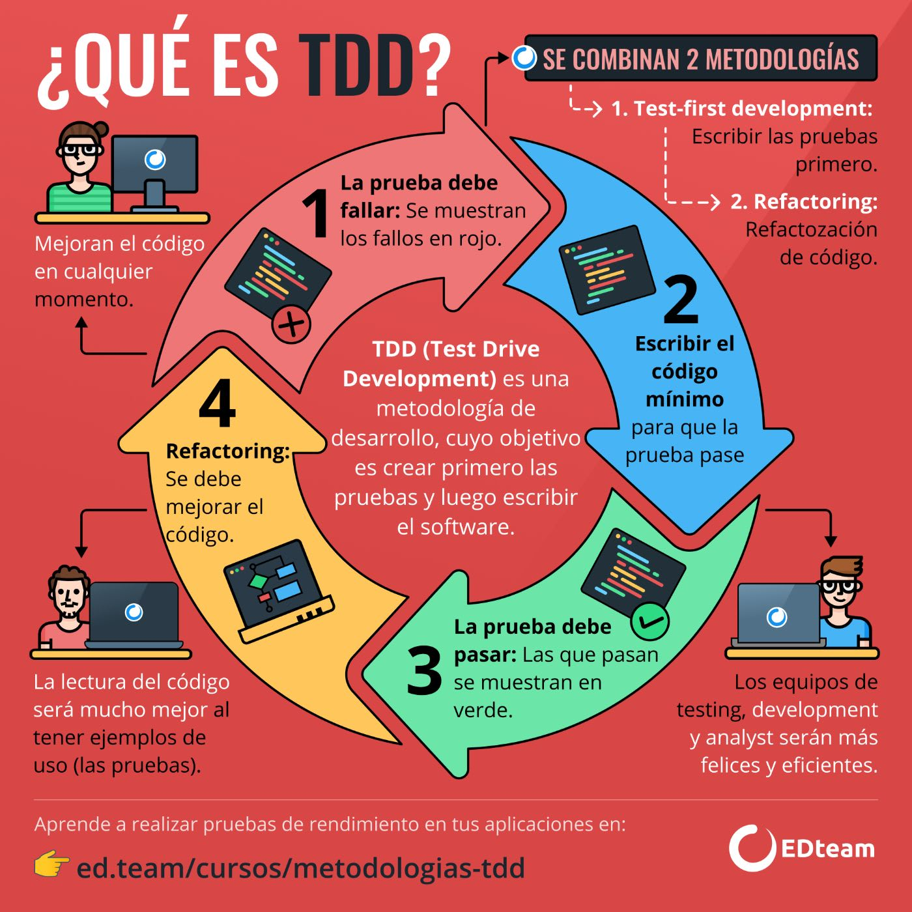

# AdventJS 2024
### Mi repo para el AdventJS del 2024

En la carpeta `src` se encuentra el código de cada día del reto.

En la carpeta `test` alojaré los test que se generaron para escribir el código en ***Typescript***.

Se usó la técnica de programación TDD [Ver imagén en la parte inferior de este documento]

[link a adventjs.dev/](https://adventjs.dev/)

Créditos de la imagen: [EDteam](https://ed.team/)

### Listado de los restos de AdventJS 2024:

Se agregarán los nombres y los enlaces a los retos una vez sean activados el día correspondiente. 🙃

- [x] 01 de diciembre de 2024 - [Reto #1: 🎁 ¡Primer regalo repetido!](https://adventjs.dev/es/challenges/2024/1)
- [ ] 02 de diciembre de 2024 - [Reto #2: 🖼️ Enmarcando nombres](https://adventjs.dev/es/challenges/2024/2)
- [ ] 03 de diciembre de 2024 - [Reto #3: 🏗️ Organizando el inventario](https://adventjs.dev/es/challenges/2024/3)
- [ ] 04 de diciembre de 2024
- [ ] 05 de diciembre de 2024
- [ ] 06 de diciembre de 2024
- [ ] 07 de diciembre de 2024
- [ ] 08 de diciembre de 2024
- [ ] 09 de diciembre de 2024
- [ ] 10 de diciembre de 2024
- [ ] 11 de diciembre de 2024
- [ ] 12 de diciembre de 2024
- [ ] 13 de diciembre de 2024
- [ ] 14 de diciembre de 2024
- [ ] 15 de diciembre de 2024
- [ ] 16 de diciembre de 2024
- [ ] 17 de diciembre de 2024
- [ ] 18 de diciembre de 2024
- [ ] 19 de diciembre de 2024
- [ ] 20 de diciembre de 2024
- [ ] 21 de diciembre de 2024
- [ ] 22 de diciembre de 2024
- [ ] 23 de diciembre de 2024
- [ ] 24 de diciembre de 2024
- [ ] 25 de diciembre de 2024